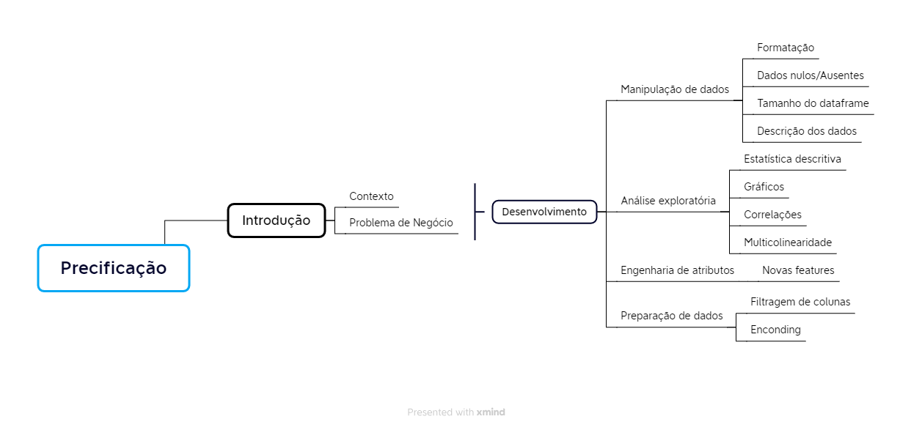

# Mercado Imobiliário de Melbourne
Dados: https://www.kaggle.com/datasets/anthonypino/melbourne-housing-market/data

## - Resumo

Este notebook explora a dinâmica dos preços imobiliários na Austrália entre 2016 - 2018. No cenário econômico com taxas de juros baixas por um período prolongado e os bancos centrais começando a aumentá-las gradualmente, espera-se uma recuperação nos preços dos imóveis. A confiança na economia global foi restaurada desde a crise imobiliária de 2007-2008. Atualmente, os bancos centrais estão elevando as taxas de juros de maneira lenta e constante para desacelerar o superaquecimento das economias nacionais.

## Objetivo

Este notebook tem como objetivo explorar e analisar a dinâmica dos preços imobiliários em Melbourne, Austrália. Utilizamos diversas técnicas de tratamento e análise de dados para garantir a precisão de nossas descobertas.

## Metodologia

Primeiro, realizamos uma limpeza de dados abrangente para lidar com valores ausentes e outliers, garantindo que nossos dados sejam confiáveis e precisos. Em seguida, aplicamos análise descritiva para obter uma compreensão clara das características gerais dos nossos dados, como média, mediana, moda, variância e desvio padrão.

Para entender as relações entre diferentes variáveis, realizamos uma análise de correlação. Isso nos ajudou a identificar quais fatores estão mais fortemente associados aos preços dos imóveis.

Também lidamos com a multicolinearidade, que ocorre quando duas ou mais variáveis independentes em um modelo de regressão estão altamente correlacionadas. Isso pode distorcer os resultados e tornar difícil determinar qual variável está afetando o resultado. Usamos técnicas como a eliminação de variáveis redundantes e a análise de fator para resolver esse problema.

Finalmente, realizamos o encoding de features categóricas. Muitos algoritmos de aprendizado de máquina requerem que as entradas sejam numéricas. Portanto, convertemos recursos categóricos, como bairros ou tipos de propriedades, em um formato numérico que pode ser usado em nosso modelo.

Ao longo do estudo, também empregamos técnicas como normalização e padronização para garantir que nossos dados estejam na mesma escala, facilitando a comparação entre diferentes variáveis.

